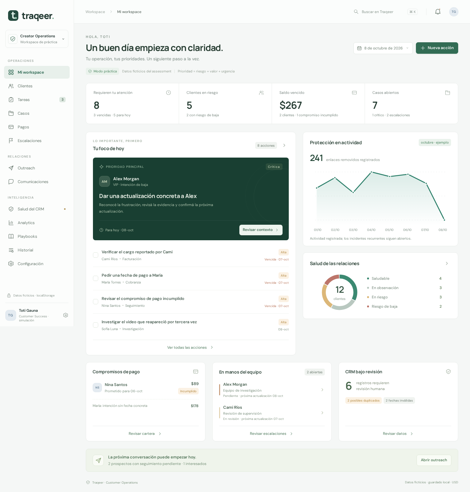

# Traqeer · Customer Operations

Frontend completo de práctica para Customer Success / Client Operations. Diseñado alrededor del assessment: cobranza, creadores VIP en riesgo, contenido recurrente, discrepancias de facturación, descuentos por confirmar, referidos y calidad de datos.

**Todos los clientes, contactos, evidencias y registros son ficticios.** No representa un sistema interno ni políticas reales de Traqeer.



[Vista móvil](docs/previews/mobile.png)

## Demo navegable

[Abrir Traqeer Customer Operations](https://traqeer-operations-demo.readyperch2.chatgpt.site)

La demo está publicada en Sites. El acceso inicial es privado para la cuenta propietaria; habilitar acceso público o compartirla antes de pedir una revisión externa. Los datos son ficticios y cada navegador mantiene su propio localStorage.

El enlace también aparece en el [PR #1](https://github.com/Santiagodval/santiTraqeerDashboard/pull/1).

## Ejecutar

Requiere Node.js 22.12+ o 24 y npm.

```bash
npm ci
npm run dev
```

Abrir la URL que muestra Vite (por defecto `http://localhost:5173`).

```bash
npm run build     # TypeScript + compilación de producción
npm run preview   # servir el build localmente
npm test          # reglas operativas y validación de datos
npx playwright install chromium
npm run test:e2e  # flujos completos con navegador y móvil
```

El resultado de producción está en `dist/`. Se puede servir desde cualquier hosting estático. No hay claves, backend ni variables de entorno obligatorias. La navegación usa hash, así que no requiere reglas especiales de redirección. Google Fonts tiene alternativas locales si no hay conexión.

## Qué incluye

- **Mi workspace:** cola ordenada por riesgo, valor y urgencia; salud de clientes, pagos, escalaciones, protección y CRM.
- **Clientes / 360°:** contacto oculto por defecto, planes de ejemplo, preferencias, descuento, próximas acciones, actividad, casos, incidentes y pagos.
- **Tareas:** seis estados, filtros, responsables, relaciones con casos/pagos/prospectos y seguimientos recurrentes sin duplicar sucesores.
- **Casos y escalaciones:** hechos separados de hipótesis, evidencia, prioridad, próxima actualización, resolución documentada y aprobación pendiente.
- **Pagos:** obligaciones manuales, aging calculado, intentos de cobranza registrados, compromisos con fecha, recepción manual y alertas de compromisos incumplidos.
- **Outreach:** prospectos, objeciones, seguimiento, handoff documentado y bloqueo de contacto cuando se marca “No contactar”.
- **Comunicaciones:** conversaciones, borradores, contactos realizados externamente, mensajes recibidos y notas; creación de seguimiento desde la interacción.
- **Salud del CRM:** datos originales del ejercicio, errores de calendario/formato, duplicados, montos ambiguos, fechas contradictorias y revisión humana.
- **Analytics:** métricas y gráficos SVG calculados sobre registros locales; métricas sin historia suficiente se muestran como no disponibles.
- **Playbooks:** guías de práctica y marcadores de política por confirmar.
- **Configuración / historial:** fecha de práctica, umbrales, alertas, roles simulados, importación/exportación, recuperación y cambios antes/después.

Todos los componentes de interfaz son propios: inputs, selección, calendario, diálogos, drawer, tabla, filtros, búsqueda, gráficos, estados, avisos, íconos y navegación. React es la única dependencia de interfaz; la animación utiliza CSS con soporte para movimiento reducido.

## Recorrido recomendado

1. Abrir a **Alex Morgan** desde la prioridad principal. Revisar casos, evidencia y actividad, luego registrar una actualización y una próxima acción.
2. Abrir **María Torres**. Debe dos meses por un total de **USD 178**. “Sí, esta semana lo veo” permanece como intención vaga, no como compromiso con fecha.
3. En **Pagos**, registrar una fecha acordada o un intento de cobranza. “Registrar pago” documenta una recepción ficticia; no realiza una transacción.
4. Revisar **Sofía** y su tercera recurrencia. En Protección se pueden registrar incidentes y actividad de remoción manual.
5. En **Salud del CRM**, revisar Vanessa o Pau. Los datos originales no se interpretan ni corrigen automáticamente y no contaminan las métricas de clientes.
6. En **Outreach**, registrar el seguimiento de Romina o documentar un handoff. “No contactar” cancela sus tareas de outreach.
7. Recargar la página para verificar persistencia. Consultar **Historial** para ver las modificaciones.

## Persistencia y límites

- Clave local: `traqeer.operations.v1`.
- La fecha inicial de práctica es **2026-10-08**. Puede cambiarse en Configuración. Las fechas de auditoría usan UTC real; la fecha operativa depende del ejercicio.
- Los cambios se guardan antes de aplicarse a la interfaz. Si el navegador rechaza la escritura, se muestra un error y no se da por guardado el cambio.
- La importación valida estructura, fechas canónicas y relaciones; requiere confirmar el reemplazo. Los registros CRM originales admiten texto inválido precisamente para poder revisarlo.
- Los datos dañados se conservan; se puede descargar el original antes de confirmar una recuperación.
- Los cambios de otra pestaña se sincronizan. Se verifica la revisión antes de guardar para reducir sobrescrituras accidentales. localStorage no ofrece transacciones atómicas ni colaboración multiusuario.
- El historial conserva snapshots locales de los registros modificados. No es inmutable ni resistente a manipulación.
- Los contactos están ocultos visualmente hasta revelarlos. El rol Operador / Supervisión / Consulta es una simulación UX; el almacenamiento se puede inspeccionar desde el navegador.
- No usar datos reales o secretos. No hay autenticación real, cifrado de registros, servicios de mensajería, conciliación bancaria ni sistema de detección/remoción integrado.
- Exportar incluye los datos y el historial del workspace. Los archivos exportados deben tratarse con el mismo cuidado que su contenido.
- Los borradores nunca se envían. Registrar un contacto significa documentar una interacción realizada externamente.
- Cambiar dominio, navegador o dispositivo no transfiere datos; usar exportación/importación.

## Arquitectura

```text
src/
  model.ts           Tipos, reglas, fechas, validación y salud CRM
  seed.ts            Dataset ficticio del assessment
  store.tsx          Persistencia, revisiones, recuperación y auditoría
  components.tsx     Primitivas custom y gráficos SVG
  forms.tsx          Formularios y mutaciones operativas
  Customer360.tsx    Perfil, timeline y contexto del cliente
  App.tsx            Navegación y las trece vistas de trabajo
  styles.css         Layout, componentes, responsive y motion
  readability.css    Jerarquía tipográfica y contraste
docs/
  PRODUCT_SPEC.md    Especificación / master prompt, revisión crítica y fases
tests/
  workspace.spec.ts Flujos de navegador
```

La [especificación completa](docs/PRODUCT_SPEC.md) incluye visión, modelo lógico, relaciones, flujos, supuestos, políticas pendientes, edge cases, criterios de aceptación y priorización MVP / Phase 2 / Nice-to-have.

Para producción, reemplazar la persistencia local por un backend con autorización, almacenamiento adecuado y auditoría durable; confirmar primero las políticas y las integraciones reales. No hay promesas financieras o técnicas automáticas.
